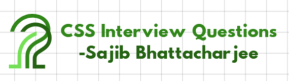

  <figure>
    &nbsp;&nbsp;&nbsp; 
    <figcaption align="center">   CSS Interview Questions </figcaption>
  </figure>

## `100 CSS Interview Questions with Solutions` 🚀

## Table of Contents 📖

1. [Basic CSS Questions](#basic-css-questions)
2. [CSS Selectors](#css-selectors)
3. [Box Model](#box-model)
4. [Positioning](#positioning)
5. [Flexbox](#flexbox)
6. [Grid](#grid)
7. [Responsive Design](#responsive-design)
8. [Transitions and Animations](#transitions-and-animations)
9. [CSS Preprocessors](#css-preprocessors)
10. [Advanced CSS](#advanced-css)

---

## Basic CSS Questions ✨

1. **What is CSS?**

   - **Solution:** CSS stands for Cascading Style Sheets. It is used to style and layout web pages — for example, to alter the font, color, size, and spacing of your content, split it into multiple columns, or add animations and other decorative features.

2. **How do you include CSS in a webpage?**

   - **Solution:** CSS can be included in a webpage in three ways:
     - ➡️ Inline: Using the `style` attribute inside HTML elements.
     - ➡️ Internal: Using the `<style>` tag within the `<head>` section.
     - ➡️ External: Using the `<link>` tag to link an external CSS file.

3. **What is the difference between `margin` and `padding`?**

   - **Solution:** `margin` is the space outside the border of an element, while `padding` is the space inside the border of an element.

4. **What is the box model in CSS?**

   - **Solution:** The CSS box model is a rectangular layout paradigm for HTML elements that consists of the following: content, padding, border, and margin.

5. **What is the difference between `display: none` and `visibility: hidden`?**

   - **Solution:** `display: none` removes the element from the document flow, and it will not take up any space. `visibility: hidden` hides the element, but it still takes up space in the layout.

6. **What is the purpose of the `z-index` property?**

   - **Solution:** The `z-index` property specifies the stack order of an element. An element with a higher `z-index` will be displayed in front of an element with a lower `z-index`.

7. **What is the difference between `em` and `rem` units?**

   - **Solution:** `em` is relative to the font-size of its closest or current element, while `rem` is relative to the font-size of the root element (`<html>`).

8. **What is the `float` property used for?**

   - **Solution:** The `float` property is used to push an element to the left or right, allowing other elements to wrap around it.

9. **What is the difference between `id` and `class` in CSS?**

   - **Solution:** An `id` is unique and can be used to identify a single element, while a `class` can be used to identify multiple elements.

10. **What is the `!important` rule in CSS?**
    - **Solution:** The `!important` rule is used to override other styling rules for a specific property. It should be used sparingly as it can make debugging difficult.

---

## CSS Selectors 🎯

11. **What is a CSS selector?**

    - **Solution:** A CSS selector is a pattern used to select the element(s) you want to style.

12. **What is the difference between `#id` and `.class` selectors?**

    - **Solution:** `#id` selects an element with a specific `id` attribute, while `.class` selects elements with a specific `class` attribute.

13. **What is the universal selector in CSS?**

    - **Solution:** The universal selector (`*`) selects all elements on the page.

14. **What is the difference between `>` and ` ` (space) in CSS selectors?**

    - **Solution:** The `>` selector selects direct children, while the ` ` (space) selector selects all descendants.

15. **What is the `:nth-child()` pseudo-class?**

    - **Solution:** The `:nth-child()` pseudo-class selects elements based on their position in a group of siblings.

16. **What is the `:hover` pseudo-class?**

    - **Solution:** The `:hover` pseudo-class applies styles to an element when the user hovers over it with the mouse.

17. **What is the `:focus` pseudo-class?**

    - **Solution:** The `:focus` pseudo-class applies styles to an element when it has focus, such as when a user clicks on an input field.

18. **What is the `:first-child` pseudo-class?**

    - **Solution:** The `:first-child` pseudo-class selects the first child element of its parent.

19. **What is the `:last-child` pseudo-class?**

    - **Solution:** The `:last-child` pseudo-class selects the last child element of its parent.

20. **What is the `:not()` pseudo-class?**
    - **Solution:** The `:not()` pseudo-class selects elements that do not match the given selector.

---

## Box Model 📦

21. **What are the components of the CSS box model?**

    - **Solution:** The components are content, padding, border, and margin.

22. **How do you calculate the total width of an element?**

    - **Solution:** Total width = width + padding-left + padding-right + border-left + border-right + margin-left + margin-right.

23. **What is the `box-sizing` property?**

    - **Solution:** The `box-sizing` property defines how the width and height of an element are calculated. The values can be `content-box` (default) or `border-box`.

24. **What is the difference between `content-box` and `border-box`?**

    - **Solution:** `content-box` includes only the content in the width and height, while `border-box` includes the content, padding, and border in the width and height.

25. **How do you center an element horizontally?**

    - **Solution:** You can use `margin: 0 auto;` or `text-align: center;` for inline elements.

26. **How do you center an element vertically?**

    - **Solution:** You can use Flexbox (`align-items: center;`) or Grid (`align-self: center;`).

27. **What is the `outline` property?**

    - **Solution:** The `outline` property is used to draw a line around an element, outside the border.

28. **What is the difference between `outline` and `border`?**

    - **Solution:** The `outline` is drawn outside the border and does not take up space, while the `border` is part of the element's box model.

29. **How do you remove the default padding and margin from all elements?**

    - **Solution:** You can use the universal selector: `* { margin: 0; padding: 0; }`.

30. **What is the `min-width` and `max-width` property?**
    - **Solution:** `min-width` sets the minimum width of an element, while `max-width` sets the maximum width.

---

## Positioning 📍

31. **What is the `position` property in CSS?**

    - **Solution:** The `position` property specifies the type of positioning method used for an element (static, relative, absolute, fixed, sticky).

32. **What is the difference between `position: absolute` and `position: relative`?**

    - **Solution:** `position: relative` positions the element relative to its normal position, while `position: absolute` positions the element relative to the nearest positioned ancestor.

33. **What is `position: fixed`?**

    - **Solution:** `position: fixed` positions the element relative to the viewport, meaning it stays in the same place even when the page is scrolled.

34. **What is `position: sticky`?**

    - **Solution:** `position: sticky` is a hybrid of relative and fixed positioning. The element is treated as relative until it crosses a specified threshold, at which point it is treated as fixed.

35. **How do you center an element with `position: absolute`?**

    - **Solution:** You can use `top: 50%; left: 50%; transform: translate(-50%, -50%);`.

36. **What is the `z-index` property?**

    - **Solution:** The `z-index` property specifies the stack order of an element. An element with a higher `z-index` will be displayed in front of an element with a lower `z-index`.

37. **What is the `top`, `right`, `bottom`, and `left` property?**

    - **Solution:** These properties are used to position an element when its `position` is set to `relative`, `absolute`, `fixed`, or `sticky`.

38. **What is the `float` property?**

    - **Solution:** The `float` property is used to push an element to the left or right, allowing other elements to wrap around it.

39. **What is the `clear` property?**

    - **Solution:** The `clear` property is used to control the behavior of floating elements. It can be set to `left`, `right`, `both`, or `none`.

40. **What is the difference between `float` and `position`?**
    - **Solution:** `float` is used for wrapping text around images, while `position` is used for precise positioning of elements.

---

## Flexbox 💪

41. **What is Flexbox?**

    - **Solution:** Flexbox is a layout model that allows you to design flexible and responsive layouts with ease.

42. **What is the `display: flex` property?**

    - **Solution:** The `display: flex` property is used to create a flex container, which enables flexbox layout for its children.

43. **What is the `flex-direction` property?**

    - **Solution:** The `flex-direction` property defines the direction in which the flex items are placed in the flex container. Values include `row`, `row-reverse`, `column`, and `column-reverse`.

44. **What is the `justify-content` property?**

    - **Solution:** The `justify-content` property aligns flex items along the main axis. Values include `flex-start`, `flex-end`, `center`, `space-between`, and `space-around`.

45. **What is the `align-items` property?**

    - **Solution:** The `align-items` property aligns flex items along the cross axis. Values include `flex-start`, `flex-end`, `center`, `baseline`, and `stretch`.

46. **What is the `align-self` property?**

    - **Solution:** The `align-self` property allows you to override the `align-items` value for individual flex items.

47. **What is the `flex-wrap` property?**

    - **Solution:** The `flex-wrap` property controls whether flex items are forced onto one line or can wrap onto multiple lines. Values include `nowrap`, `wrap`, and `wrap-reverse`.

48. **What is the `flex-grow` property?**

    - **Solution:** The `flex-grow` property defines the ability for a flex item to grow if necessary. It accepts a unitless value that serves as a proportion.

49. **What is the `flex-shrink` property?**

    - **Solution:** The `flex-shrink` property defines the ability for a flex item to shrink if necessary. It accepts a unitless value that serves as a proportion.

50. **What is the `flex-basis` property?**
    - **Solution:** The `flex-basis` property sets the initial main size of a flex item before any available space is distributed.

---

## Grid 🌐

51. **What is CSS Grid?**

    - **Solution:** CSS Grid is a layout system that allows you to create complex, responsive layouts with rows and columns.

52. **What is the `display: grid` property?**

    - **Solution:** The `display: grid` property is used to create a grid container, which enables grid layout for its children.

53. **What is the `grid-template-columns` property?**

    - **Solution:** The `grid-template-columns` property defines the number and size of columns in a grid layout.

54. **What is the `grid-template-rows` property?**

    - **Solution:** The `grid-template-rows` property defines the number and size of rows in a grid layout.

55. **What is the `grid-gap` property?**

    - **Solution:** The `grid-gap` property sets the gap between grid rows and columns. It is a shorthand for `grid-row-gap` and `grid-column-gap`.

56. **What is the `grid-column` property?**

    - **Solution:** The `grid-column` property specifies the start and end positions of a grid item within the grid columns.

57. **What is the `grid-row` property?**

    - **Solution:** The `grid-row` property specifies the start and end positions of a grid item within the grid rows.

58. **What is the `grid-area` property?**

    - **Solution:** The `grid-area` property is a shorthand for `grid-row-start`, `grid-column-start`, `grid-row-end`, and `grid-column-end`.

59. **What is the `justify-items` property?**

    - **Solution:** The `justify-items` property aligns grid items along the inline (row) axis. Values include `start`, `end`, `center`, and `stretch`.

60. **What is the `align-items` property?**
    - **Solution:** The `align-items` property aligns grid items along the block (column) axis. Values include `start`, `end`, `center`, and `stretch`.

---

## Responsive Design 📱

61. **What is responsive design?**

    - **Solution:** Responsive design is an approach to web design that makes web pages render well on a variety of devices and window or screen sizes.

62. **What is a media query?**

    - **Solution:** A media query is a CSS technique that applies styles based on the characteristics of the device, such as screen width, height, or orientation.

63. **How do you write a media query?**

    - **Solution:** Media queries are written using the `@media` rule, followed by the condition and the CSS rules to apply. Example: `@media (max-width: 768px) { ... }`.

64. **What is the difference between `min-width` and `max-width` in media queries?**

    - **Solution:** `min-width` applies styles when the viewport is wider than the specified width, while `max-width` applies styles when the viewport is narrower than the specified width.

65. **What is the `viewport` meta tag?**

    - **Solution:** The `viewport` meta tag controls the layout on mobile browsers. Example: `<meta name="viewport" content="width=device-width, initial-scale=1.0">`.

66. **What is the difference between `em` and `rem` in responsive design?**

    - **Solution:** `em` is relative to the font-size of its closest or current element, while `rem` is relative to the font-size of the root element (`<html>`).

67. **What is the `vh` and `vw` unit?**

    - **Solution:** `vh` stands for viewport height, and `vw` stands for viewport width. They are relative to the size of the viewport.

68. **What is the `calc()` function?**

    - **Solution:** The `calc()` function allows you to perform calculations to determine CSS property values. Example: `width: calc(100% - 20px);`.

69. **What is the `clamp()` function?**

    - **Solution:** The `clamp()` function allows you to set a value that is clamped between a minimum and maximum value. Example: `font-size: clamp(1rem, 2.5vw, 2rem);`.

70. **What is the difference between `flexbox` and `grid` in responsive design?**
    - **Solution:** Flexbox is better for one-dimensional layouts (either rows or columns), while Grid is better for two-dimensional layouts (rows and columns).

---

## Transitions and Animations 🎬

71. **What is the `transition` property?**

    - **Solution:** The `transition` property allows you to define the transition between two states of an element. Example: `transition: all 0.3s ease;`.

72. **What is the `animation` property?**

    - **Solution:** The `animation` property allows you to create complex animations by defining keyframes. Example: `animation: slide 2s infinite;`.

73. **What is a `keyframe` in CSS?**

    - **Solution:** A `keyframe` is a point in the animation sequence where you define the styles that should be applied at that point.

74. **How do you define a keyframe?**

    - **Solution:** Keyframes are defined using the `@keyframes` rule. Example: `@keyframes slide { from { transform: translateX(0); } to { transform: translateX(100px); } }`.

75. **What is the difference between `transition` and `animation`?**

    - **Solution:** `transition` is used for simple animations between two states, while `animation` is used for more complex animations with multiple

76. **What is the `transform` property?**

    - **Solution:** The `transform` property allows you to rotate, scale, skew, or translate an element. Example: `transform: rotate(45deg);`.

77. **What is the `translate()` function?**

    - **Solution:** The `translate()` function moves an element along the X and Y axes. Example: `transform: translate(50px, 100px);`.

78. **What is the `scale()` function?**

    - **Solution:** The `scale()` function scales an element by a factor. Example: `transform: scale(1.5);`.

79. **What is the `rotate()` function?**

    - **Solution:** The `rotate()` function rotates an element by a specified angle. Example: `transform: rotate(45deg);`.

80. **What is the `skew()` function?**
    - **Solution:** The `skew()` function skews an element along the X and Y axes. Example: `transform: skew(30deg, 20deg);`.

---

## CSS Preprocessors ⚙️

81. **What is a CSS preprocessor?**

    - **Solution:** A CSS preprocessor is a scripting language that extends CSS and compiles it into regular CSS. Examples include SASS, LESS, and Stylus.

82. **What is SASS?**

    - **Solution:** SASS (Syntactically Awesome Stylesheets) is a CSS preprocessor that adds features like variables, nesting, and mixins to CSS.

83. **What are the benefits of using a CSS preprocessor?**

    - **Solution:** Benefits include:
      - ➡️ Increased code maintainability.
      - ➡️ Improved code organization through nesting and mixins.
      - ➡️ Use of variables for managing consistent styles.
      - ➡️ Ability to write more concise and DRY (Don't Repeat Yourself) code.

84. **What are variables in SASS?**

    - **Solution:** Variables in SASS allow you to store values (like colors or font sizes) that can be reused throughout your stylesheet. They start with a `$`. Example: `$primary-color: blue;`

85. **What are mixins in SASS?**

    - **Solution:** Mixins are reusable blocks of CSS code that you can include in your styles. They start with `@mixin`. Example: `@mixin rounded-corners($radius) { border-radius: $radius; }`

86. **What is nesting in SASS?**

    - **Solution:** Nesting allows you to nest CSS selectors within each other, making your code more organized and readable.

87. **What are extends in SASS?**

    - **Solution:** Extends allow you to share styles between selectors. One selector can inherit the styles of another selector. Uses `@extend`.

88. **What is the difference between mixins and extends in SASS?**

    - **Solution:** Mixins include the actual CSS code within the compiled output, while extends create more efficient CSS by grouping selectors that share the same styles. Mixins are generally more flexible.

89. **What is LESS?**

    - **Solution:** LESS (Leaner Style Sheets) is another CSS preprocessor similar to SASS.

90. **What are some other CSS preprocessors besides SASS and LESS?**
    - **Solution:** Stylus is another popular CSS preprocessor.

---

## Advanced CSS ⚙️

91. **What is the CSS Grid Layout Module?**

    - **Solution:** CSS Grid Layout is a powerful two-dimensional layout system for the web. It allows for complex layouts with rows and columns.

92. **What is the CSS Flexbox Layout Module?**

    - **Solution:** Flexbox is a one-dimensional layout method for arranging items in a row or a column.

93. **What are CSS Custom Properties (Variables)?**

    - **Solution:** CSS Custom Properties (also known as CSS variables) are entities defined by web authors that contain values that can be reused throughout a stylesheet. They are defined using `--`. Example: `--primary-color: blue;`

94. **What is the `var()` function in CSS?**

    - **Solution:** The `var()` function is used to access the value of a CSS custom property. Example: `color: var(--primary-color);`

95. **What is the `calc()` function in CSS?**

    - **Solution:** The `calc()` function allows you to perform calculations within your CSS. Example: `width: calc(100% - 20px);`

96. **What is the `filter` property in CSS?**

    - **Solution:** The `filter` property provides effects like blur, grayscale, and drop-shadow to elements. Example: `filter: blur(5px);`

97. **What is the `backdrop-filter` property?**

    - **Solution:** The `backdrop-filter` property applies filter effects to the area behind an element.

98. **What is the `clip-path` property?**

    - **Solution:** The `clip-path` property creates a clipping region that defines what parts of an element are visible.

99. **What are CSS Shapes?**

    - **Solution:** CSS Shapes allow you to create complex, non-rectangular shapes for elements.

100.  **What is the `object-fit` property?**
      - **Solution:** The `object-fit` property specifies how the content of a replaced element (like an `` or `<video>`) should be resized to fit its container

---

##### 🛡️ `All rights reserved by Sajib Bhattacharjee @2025`

### 👨‍💻 `Created with ❤️ by -->`

✨ **Sajib Bhattacharjee** ✨

**💖 Dedicated to "Sir! Anisul Islam" 💖**

> > > > ### 🙏 Thanks a Lot for Visiting...!!!

🌐 [**Portfolio & Projects**](https://github.com/Sajib-Bhattacharjee)  
💼 [**LinkedIn**](https://www.linkedin.com/in/sajib-bhattacharjee-42682a178/)  
📧 [**Contact Me**](mailto:sajibbhattacjarjee2000@gmail.com)

